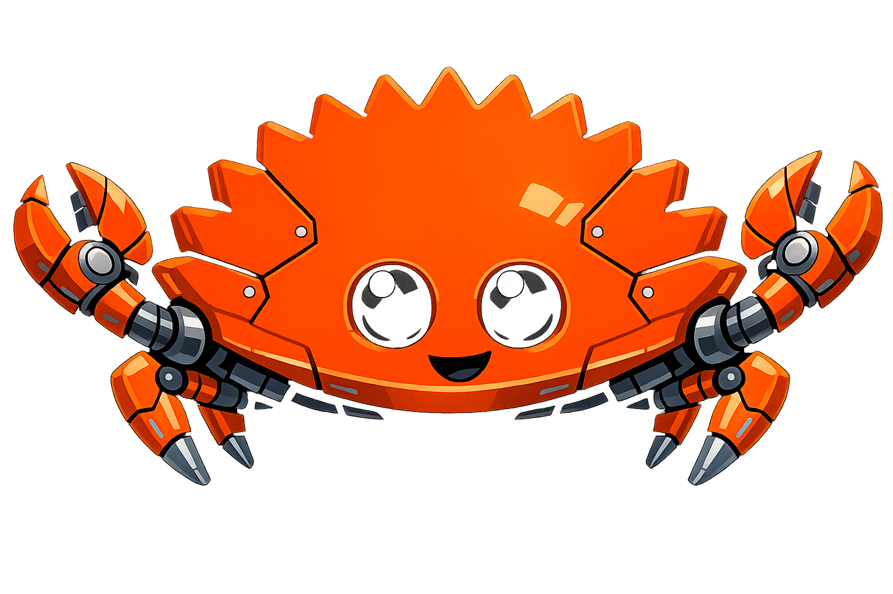

# CrabBot 🦀

<p align="center">
    <picture>
  
    </picture>
</p>

**CrabBot** is a **Rust-native, local-first agent runtime** inspired by OpenClaw’s architecture. It reimplements similar ideas with a focus on **efficiency, small footprint, and explicit control**, avoiding heavy JavaScript stacks and hidden agent state.

> ⚠️ **Status: Work in Progress (WIP)**
> CrabBot is under active development. APIs, on-disk formats, and behavior are expected to change.

## What CrabBot Is

CrabBot runs a local **runtime** that:

- Manages **sessions**, **runs**, and **queues**
- Persists all state locally as transparent files (JSON / JSONL)
- Builds prompts deterministically from history + system rules
- Executes **explicit, auditable tools** (no raw shell access)
- Works with **self-hosted LLMs** and OpenAI-compatible APIs

There is **no hidden memory** and no background agent magic. If the model “remembers” something, you can find it on disk.

## Inspiration

CrabBot is **inspired by OpenClaw’s local agent model**, particularly its gateway-centric design and file-backed session memory.

CrabBot is **not a fork**, **not compatible**, and **not affiliated** with OpenClaw.
The goal is a clean reimplementation in Rust with different trade-offs:

- smaller runtime
- simpler install
- simpler self hosted setups

## Build & RunLocal

### Docker

```bash
docker build -t crabbot:latest .
docker run --rm crabbot:latest
```

### Local

This repository contains **two parts**:

- **crabbot-runtime** – the Rust server / runtime (native binary)
- **crabbot-ui** – the Web UI (WASM, built separately)

They are built together using **Cargo Make**.

---

### Prerequisites

Install these once:

```bash
# Rust toolchain
rustup update

# WASM target for the UI
rustup target add wasm32-unknown-unknown

# Trunk (WASM build tool for Leptos)
cargo install trunk

# Cargo Make (task runner)
cargo install cargo-make
```

---

### Development (hot reload UI)

Runs the runtime and builds the UI in **development mode**.

```bash
cargo make dev
```

What this does:

- Builds the Web UI into `target/debug/bundle/ui-dist`
- Starts `crabbot-runtime`
- Watches UI files and rebuilds on change
- Serves the UI at:
  **[http://localhost:PORT/ui/](http://localhost:PORT/ui/)**

(Port depends on your runtime config.)

---

### Release Build

Creates a **self-contained release bundle**.

```bash
cargo make release
```

Output:

```text
dist/
├── crabbot
└── ui-dist/
```

Run it manually:

```bash
./dist/crabbot
```

The runtime automatically serves `ui-dist/` next to the binary.

---

### Environment Overrides (optional)

You can override the UI directory manually:

```bash
CRABBOT_UI_DIST=/path/to/ui-dist ./crabbot
```

By default, the runtime looks for `ui-dist/` **next to its executable**.

---

### Clean Build

Remove all generated artifacts:

```bash
cargo clean
rm -rf dist
```

---

### Summary

| Task        | Command                  |
| ----------- | ------------------------ |
| Dev mode    | `cargo make dev`         |
| Release     | `cargo make release`     |
| Run release | `./dist/crabbot-runtime` |

## Planned Components

- Rust runtime (async, single-binary)
- File-backed session + transcript store
- Tool registry and execution engine compatible ith clawhub
- Local CLI (TUI-first)
- web / native UI via WASM
- Optional webhook ingress via rm87
- m87 based remote device access

## License

Apache License 2.0.
